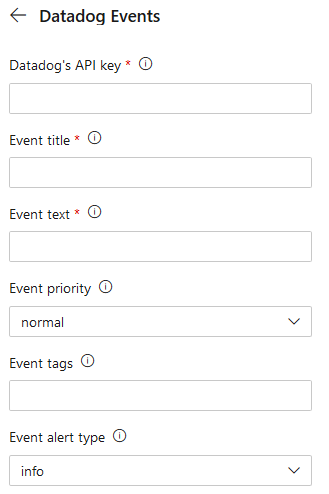

This extentions provides build and release tasks to send Events to Datadog.

## How to use

After installing the extension, you can add its tasks to a [build definition](https://docs.microsoft.com/en-us/azure/devops/pipelines/get-started-designer?view=vsts&tabs=new-nav) or [release definition](https://docs.microsoft.com/en-us/azure/devops/pipelines/release/define-multistage-release-process?view=vsts) as needed.

## Feedback and issues

Please file an issue on [GitHub](https://github.com/billbatista/vsts-datadogevents/issues)
